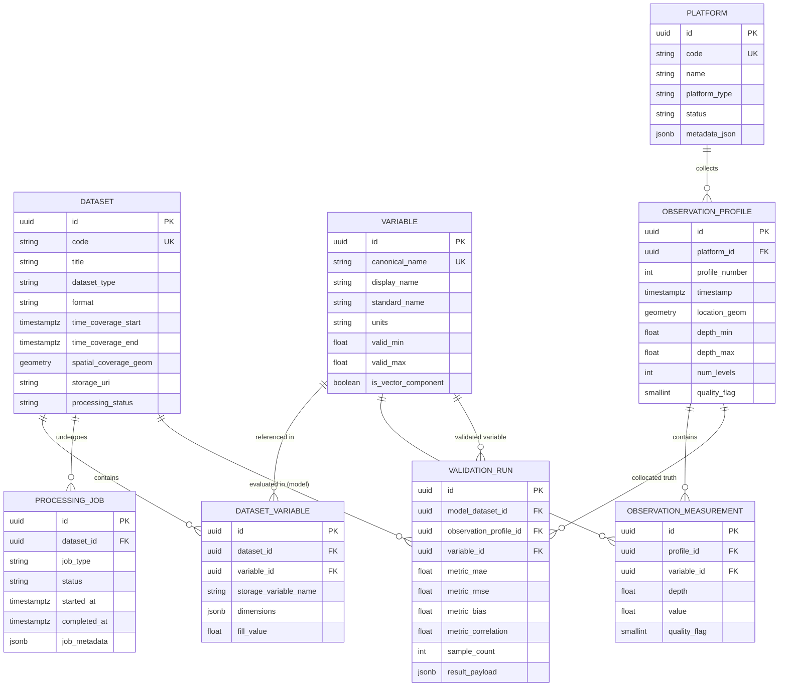

# NEREUS — Data Architecture & Canonical Data Model Specification

## 1. Storage Separation Model

NEREUS enforces a strict dual-tier storage architecture separating relational/spatial metadata and observation points from high-volume multidimensional scientific grids.

```text
┌────────────────────────────────────────────────────────────────────────┐
│                          NEREUS STORAGE TIERS                          │
├───────────────────────────────────┬────────────────────────────────────┤
│       PostgreSQL + PostGIS        │        Scientific Array Store      │
│   (Relational & Spatial Metadata) │         (NetCDF4 / Zarr)           │
├───────────────────────────────────┼────────────────────────────────────┤
│ • Dataset Catalog & Provenance    │ • 4D Gridded Ocean Fields (T, S)   │
│ • Variable Registry & Metadata    │ • Ocean Current Velocity (U, V, W) │
│ • Platform / Instrument Catalog   │ • Bathymetry & Topography Grids    │
│ • Observation Profiles & Casts    │ • High-Resolution Depth Volumes    │
│ • Discrete In-situ Measurements   │ • Numerical Model Forecast Cubes   │
│ • Ingestion & Processing Job Logs │ • Climatology & Anomaly Baselines  │
│ • Validation Runs & Metrics       │ • Downsampled Visualization Cubes  │
└───────────────────────────────────┴────────────────────────────────────┘
```

> **Core Rule:** Dense multidimensional arrays (e.g., $1440 \times 720 \times 50 \times 365$ ocean data cubes) must never be flattened into individual relational rows in PostgreSQL. They remain stored as optimized, chunked NetCDF4 or Zarr files accessed via `xarray`.

---

## 2. Canonical Data Model Entities

The relational/spatial metadata schema in PostgreSQL + PostGIS is structured around the following canonical entities:

### 2.1 DATASET
Represents an authoritative scientific data collection, model forecast run, satellite compilation, or reanalysis product.

- **`id`** (`UUID`, Primary Key): Stable unique identifier.
- **`code`** (`VARCHAR(64)`, Unique): Machine-readable identifier (e.g., `hycom_glbu0_08_global`, `argo_global_gdac`, `incois_indian_ocean_reanalysis`).
- **`title`** (`VARCHAR(255)`): Human-readable name.
- **`description`** (`TEXT`): Detailed summary of dataset coverage and methodology.
- **`source_provider`** (`VARCHAR(128)`): Data originator (e.g., `INCOIS`, `NOAA`, `Copernicus Marine Service`, `ARGO GDAC`).
- **`dataset_type`** (`ENUM`): `MODEL_FORECAST`, `REANALYSIS`, `SATELLITE_OBSERVATION`, `CLIMATOLOGY`, `IN_SITU_NETWORK`.
- **`format`** (`ENUM`): `NETCDF4`, `ZARR`, `CSV_INSITU`.
- **`version`** (`VARCHAR(32)`): Dataset or release version.
- **`time_coverage_start`** (`TIMESTAMPTZ`): Temporal beginning of available data.
- **`time_coverage_end`** (`TIMESTAMPTZ`): Temporal end of available data.
- **`spatial_coverage_geom`** (`GEOMETRY(Polygon, 4326)`): PostGIS polygon of geographic bounding envelope.
- **`depth_min`** (`DOUBLE PRECISION`): Shallowest depth level in meters ($m$).
- **`depth_max`** (`DOUBLE PRECISION`): Deepest depth level in meters ($m$).
- **`storage_uri`** (`VARCHAR(512)`): Filepath or object storage URI pointing to the underlying NetCDF/Zarr root.
- **`processing_status`** (`ENUM`): `UNPROCESSED`, `VALIDATING`, `INDEXED`, `ERROR`, `DEPRECATED`.
- **`provenance_metadata`** (`JSONB`): Raw origin attributes, download source URL, citation, and checksums.
- **`created_at`** (`TIMESTAMPTZ`): Record creation timestamp.
- **`updated_at`** (`TIMESTAMPTZ`): Record modification timestamp.

---

### 2.2 VARIABLE
Represents a scientific parameter registered in the NEREUS catalog. This registry is completely decoupled and extensible, allowing new physical, chemical, or biological ocean parameters without modifying schema tables.

- **`id`** (`UUID`, Primary Key): Unique identifier.
- **`canonical_name`** (`VARCHAR(64)`, Unique): Standard machine name (e.g., `temperature`, `salinity`, `u_current`, `v_current`, `w_current`, `sea_surface_height`, `chlorophyll`, `dissolved_oxygen`, `density`, `ph`).
- **`display_name`** (`VARCHAR(128)`): User-friendly display label (e.g., *Potential Temperature*, *Practical Salinity*, *Eastward Current Velocity*).
- **`standard_name`** (`VARCHAR(128)`): Official CF (Climate and Forecast) convention name (e.g., `sea_water_potential_temperature`, `sea_water_practical_salinity`).
- **`units`** (`VARCHAR(32)`): Standard SI or oceanographic unit string (e.g., `degC`, `PSU`, `m/s`, `mg/m3`, `kg/m3`, `micromol/kg`).
- **`description`** (`TEXT`): Scientific definition and physical meaning.
- **`data_type`** (`VARCHAR(32)`): Underlying numeric type (`float32`, `float64`, `int16`).
- **`valid_min`** (`DOUBLE PRECISION`): Physical plausibility lower threshold.
- **`valid_max`** (`DOUBLE PRECISION`): Physical plausibility upper threshold.
- **`colormap_default`** (`VARCHAR(64)`): Recommended visualization colormap (e.g., `cmocean.thermal`, `cmocean.haline`, `viridis`).
- **`is_vector_component`** (`BOOLEAN`): Indicates if the variable is part of a vector field (e.g., velocity components).
- **`created_at`** (`TIMESTAMPTZ`): Creation timestamp.

---

### 2.3 DATASET_VARIABLE (Association)
Maps available variables inside specific gridded datasets, including internal storage variable keys and chunk configurations.

- **`id`** (`UUID`, Primary Key).
- **`dataset_id`** (`UUID`, Foreign Key -> `DATASET.id`): Associated dataset.
- **`variable_id`** (`UUID`, Foreign Key -> `VARIABLE.id`): Associated variable.
- **`storage_variable_name`** (`VARCHAR(64)`): Internal array name inside the NetCDF/Zarr file (e.g., `water_temp`, `so`, `uo`).
- **`dimensions`** (`JSONB`): Dimension ordering (e.g., `["time", "depth", "lat", "lon"]`).
- **`chunk_shape`** (`JSONB`): Array chunk dimensions for query optimization.
- **`fill_value`** (`DOUBLE PRECISION`): Missing / fill value constant (e.g., `-999.0`, `1e20`).

---

### 2.4 INSTRUMENT / PLATFORM
Represents the physical or logical observation platform generating in-situ ocean data.

- **`id`** (`UUID`, Primary Key): Unique identifier.
- **`code`** (`VARCHAR(64)`, Unique): Identifier code (e.g., WMO ID `2902123`, Glider ID `unit_398`, Buoy `RAMA_12N_90E`).
- **`name`** (`VARCHAR(128)`): Platform designation or vessel name.
- **`platform_type`** (`ENUM`): `ARGO_FLOAT`, `UNDERWATER_GLIDER`, `CTD_STATION`, `MOORED_BUOY`, `DRIFTING_BUOY`, `RESEARCH_VESSEL`, `SAILDRONE`.
- **`country_pi`** (`VARCHAR(128)`): Principal investigator or deploying country/institution.
- **`deployment_date`** (`TIMESTAMPTZ`): Platform launch / commission timestamp.
- **`status`** (`ENUM`): `ACTIVE`, `INACTIVE`, `DECOMMISSIONED`, `LOST`.
- **`metadata_json`** (`JSONB`): Platform telemetry, sensor serial numbers, calibration records.
- **`created_at`** (`TIMESTAMPTZ`): Creation timestamp.

---

### 2.5 OBSERVATION_PROFILE
Represents a discrete spatio-temporal collection of vertical ocean measurements (e.g., an ARGO surfacing ascent, a CTD hydrographic station cast, or a glider dive transect). Grouping avoids duplicating trajectory metadata across individual measurement points.

- **`id`** (`UUID`, Primary Key): Unique profile identifier.
- **`platform_id`** (`UUID`, Foreign Key -> `PLATFORM.id`): Associated observation platform.
- **`profile_number`** (`INTEGER`): Cycle or cast index (e.g., ARGO cycle #42).
- **`direction`** (`VARCHAR(1)`): `A` (Ascending) or `D` (Descending).
- **`timestamp`** (`TIMESTAMPTZ`): Observation capture timestamp (UTC).
- **`location_geom`** (`GEOMETRY(Point, 4326)`): PostGIS point representing $(lon, lat)$ coordinate of the profile.
- **`depth_min`** (`DOUBLE PRECISION`): Shallowest measurement depth in cast ($m$).
- **`depth_max`** (`DOUBLE PRECISION`): Deepest measurement depth in cast ($m$).
- **`num_levels`** (`INTEGER`): Number of discrete vertical depth measurements.
- **`quality_flag`** (`SMALLINT`): Overall profile QC flag (e.g., `1` = Good, `2` = Probably Good, `3` = Bad).
- **`provenance_source`** (`VARCHAR(255)`): Source file or data stream from which profile was ingested.
- **`created_at`** (`TIMESTAMPTZ`): Ingestion timestamp.

---

### 2.6 OBSERVATION_MEASUREMENT
Represents an individual point measurement in vertical space within an observation profile.

- **`id`** (`UUID`, Primary Key): Measurement identifier.
- **`profile_id`** (`UUID`, Foreign Key -> `OBSERVATION_PROFILE.id`): Parent profile.
- **`variable_id`** (`UUID`, Foreign Key -> `VARIABLE.id`): Measured scientific parameter.
- **`depth`** (`DOUBLE PRECISION`): Measurement depth in meters ($m$, positive downward).
- **`pressure`** (`DOUBLE PRECISION`): Hydrostatic pressure in decibars ($dbar$).
- **`value`** (`DOUBLE PRECISION`): Measured physical value.
- **`quality_flag`** (`SMALLINT`): QC flag according to international standard flags ($1=\text{Good}, 2=\text{Probably Good}, 3=\text{Bad}, 4=\text{Unchangeable}, 9=\text{Missing}$).
- **`created_at`** (`TIMESTAMPTZ`): Timestamp.

---

### 2.7 PROCESSING_JOB
Tracks asynchronous ingestion, validation, normalization, indexation, or derived-product generation tasks.

- **`id`** (`UUID`, Primary Key): Job execution identifier.
- **`dataset_id`** (`UUID`, Nullable, Foreign Key -> `DATASET.id`): Target or source dataset.
- **`job_type`** (`ENUM`): `DATASET_INGESTION`, `QUALITY_VALIDATION`, `COORDINATE_NORMALIZATION`, `DERIVED_ANOMALY_COMPUTE`, `SPATIAL_INDEXING`.
- **`status`** (`ENUM`): `QUEUED`, `RUNNING`, `COMPLETED`, `FAILED`, `CANCELLED`.
- **`initiated_by`** (`VARCHAR(128)`): User, automated cron, or system pipeline trigger.
- **`started_at`** (`TIMESTAMPTZ`): Execution start timestamp.
- **`completed_at`** (`TIMESTAMPTZ`): Execution finish timestamp.
- **`error_message`** (`TEXT`): Failure stack trace or error diagnostic.
- **`logs_uri`** (`VARCHAR(512)`): Path to detailed execution logs.
- **`job_metadata`** (`JSONB`): Execution parameters, record counts, processing stats.
- **`created_at`** (`TIMESTAMPTZ`): Creation timestamp.

---

### 2.8 VALIDATION_RUN
Records quantitative scientific verification comparing numerical model predictions against ground-truth in-situ observations.

- **`id`** (`UUID`, Primary Key): Validation run identifier.
- **`model_dataset_id`** (`UUID`, Foreign Key -> `DATASET.id`): Numerical model dataset under evaluation.
- **`observation_dataset_id`** (`UUID`, Nullable, Foreign Key -> `DATASET.id`): Observational dataset or collection reference.
- **`observation_profile_id`** (`UUID`, Nullable, Foreign Key -> `OBSERVATION_PROFILE.id`): Specific profile collocated (if single profile validation).
- **`variable_id`** (`UUID`, Foreign Key -> `VARIABLE.id`): Ocean variable evaluated (e.g., Temperature).
- **`spatial_scope_geom`** (`GEOMETRY(Polygon, 4326)`): Geographic bounding area of validation.
- **`time_range_start`** (`TIMESTAMPTZ`): Start of comparison window.
- **`time_range_end`** (`TIMESTAMPTZ`): End of comparison window.
- **`depth_level_min`** (`DOUBLE PRECISION`): Minimum evaluation depth ($m$).
- **`depth_level_max`** (`DOUBLE PRECISION`): Maximum evaluation depth ($m$).
- **`metric_mae`** (`DOUBLE PRECISION`): Mean Absolute Error.
- **`metric_rmse`** (`DOUBLE PRECISION`): Root Mean Square Error.
- **`metric_bias`** (`DOUBLE PRECISION`): Mean Model Bias ($\bar{M} - \bar{O}$).
- **`metric_correlation`** (`DOUBLE PRECISION`): Pearson Correlation Coefficient ($r$).
- **`sample_count`** (`INTEGER`): Total number of collocated point pairs.
- **`result_payload`** (`JSONB`): Collocation scatter points, depth-residual curves, and detailed distribution stats.
- **`created_at`** (`TIMESTAMPTZ`): Timestamp of run.

---

## 3. Entity-Relationship (ER) Model



---

## 4. Scientific Provenance & Data Quality Traceability

NEREUS architecture ensures full scientific repeatability and origin tracing:

```text
[Frontend Visualizer / Chart]
       │
       ▼
[API Response (Collocated Result / Slice / Profile)]
       │
       ├──► [Observation Profile & Measurements]
       │         │
       │         └──► [Platform / WMO Instrument & Deployment Metadata]
       │                   │
       │                   └──► [Provider Feed (ARGO GDAC / INCOIS)]
       │
       └──► [Model Slice / Grid]
                 │
                 └──► [Processing Job (Validation & Normalization Log)]
                           │
                           └──► [Source Dataset & Storage URI (NetCDF/Zarr)]
                                     │
                                     └──► [Model Originator & Forcing Data]
```

### Quality Control (QC) Standard Flags
NEREUS maps observation quality indicators to standard international scales:
- **`0`**: No QC performed.
- **`1`**: Good data (passed all physical and climatological tests).
- **`2`**: Probably good data.
- **`3`**: Bad data that may be correctable.
- **`4`**: Bad data (out of physical bounds, rejected).
- **`9`**: Missing value.

---

## 5. Conceptual Indexing Strategy

When database implementation commences, the following indexes are planned for high-throughput spatial and temporal queries:

1. **Spatial Indexes (PostGIS R-Tree / GiST):**
   - `CREATE INDEX idx_dataset_spatial ON DATASET USING GIST (spatial_coverage_geom);`
   - `CREATE INDEX idx_profile_location ON OBSERVATION_PROFILE USING GIST (location_geom);`
2. **Temporal & Profile Indexes (B-Tree):**
   - `CREATE INDEX idx_profile_platform_time ON OBSERVATION_PROFILE (platform_id, timestamp DESC);`
   - `CREATE INDEX idx_dataset_time_range ON DATASET (time_coverage_start, time_coverage_end);`
3. **Measurement Lookups (Multi-column Composite):**
   - `CREATE INDEX idx_measurement_profile_depth ON OBSERVATION_MEASUREMENT (profile_id, depth ASC);`
   - `CREATE INDEX idx_measurement_var_depth ON OBSERVATION_MEASUREMENT (variable_id, depth ASC);`
4. **Job & Validation Lookups:**
   - `CREATE INDEX idx_processing_job_status ON PROCESSING_JOB (dataset_id, status);`
   - `CREATE INDEX idx_validation_model_var ON VALIDATION_RUN (model_dataset_id, variable_id);`

---

## 6. Slicing, Subsetting & Serving Strategy (Scientific Grid Integration)

To achieve fluid 60 FPS rendering in the frontend, the FastAPI backend bridges PostgreSQL metadata with NetCDF/Zarr scientific cubes:

1. **Spatial-Temporal Slicing:** Frontend requests bounds $(lon_1, lat_1, lon_2, lat_2, z, t)$. Backend verifies dataset metadata in PostgreSQL, locates the file via `storage_uri`, and extracts a NumPy slice via `xarray` without loading unneeded chunks into memory.
2. **Decimation & LOD:** High-resolution arrays are sub-sampled to viewport dimensions before transmission.
3. **Collocation Queries:** Backend joins in-situ `OBSERVATION_PROFILE` points from PostGIS with the nearest model grid cell in `xarray` to generate on-the-fly validation curves.

---

## 7. Database Implementation — NEXT STEP

> [!IMPORTANT]
> This completes the conceptual and canonical data architecture design. 
> The **next phase** will convert this canonical model into concrete PostgreSQL/PostGIS implementation utilizing **SQLAlchemy 2.0 ORM models**, **Pydantic schemas**, and version-controlled **Alembic database migrations**.
